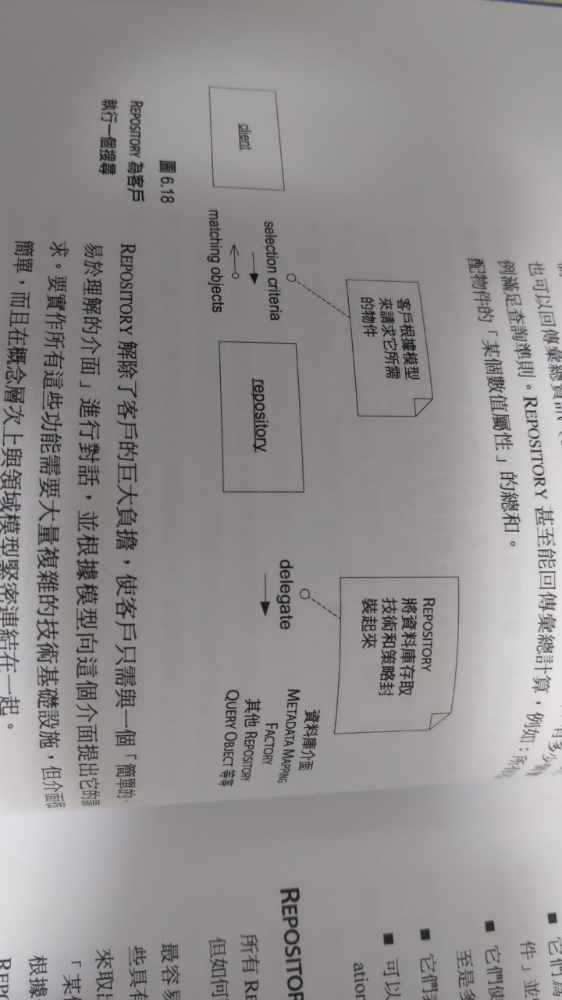
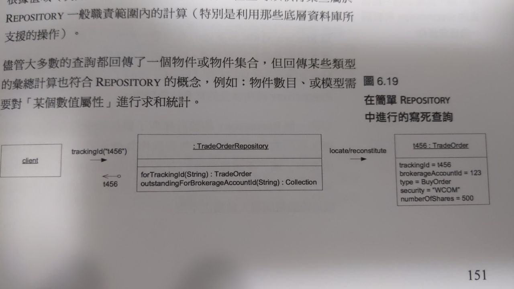
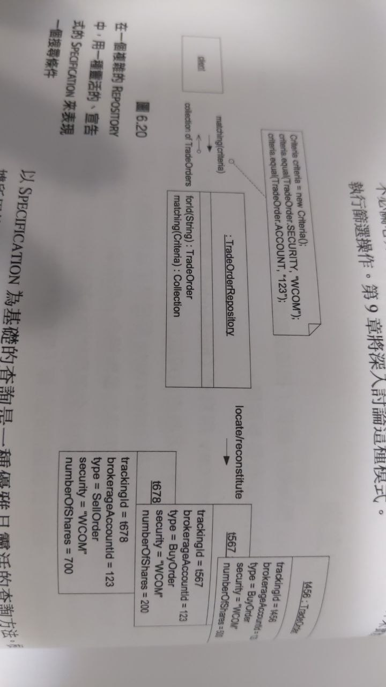
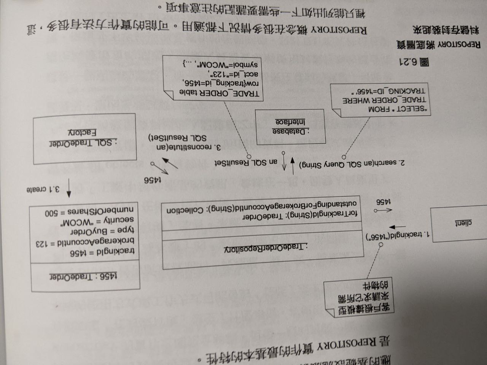
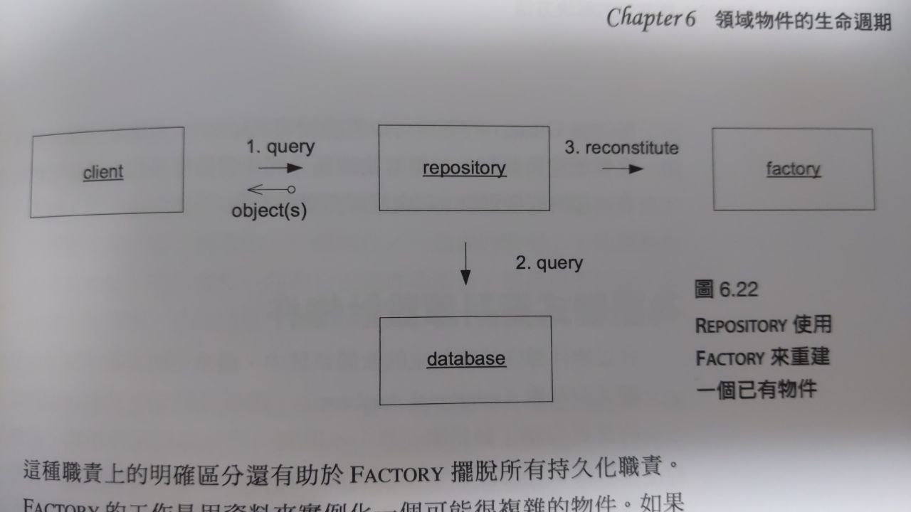
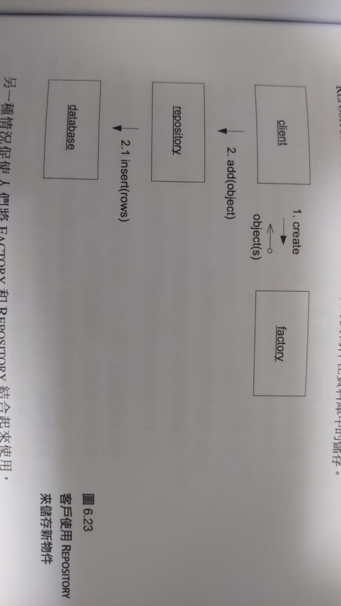

# O - Objective (觀察外在客觀、事實)

* Repository
    * Reference，取得作為起點的物件
        * Create the object (建立物件)
        * Traverse an association (遍歷相關)
    * 【搜尋的解偶】與【關聯的內聚】之間做權衡
        * Customer 物件內應具備該客戶已訂的 Order ? 透過 CutomerId 在資料庫中搜尋 Order ?
        * 適當地結合 search 與 association
    * reconstitution (重建)
        * 使用已儲存的資料建立 instance 的過程 (query from DB and parse as entity)
    * 除【透過根遍歷搜尋物件】，禁止其他方法存取 aggregate 內部的物件
    * 大多數物件都 **不應** 透過全域搜尋作存取
    * 功能
        * Query and metadata by request
        * Return summary information
        * 簡單、易於理解的 intrerface
        * 為每種需要全域存取的物件，作為集合的【替身】(眾所周知的 interface 存取)、【實際插入或刪除資料的操作】
        * 根據具體條件挑選物件、回傳【屬性值滿足查詢準則】
        * Sample
            * search for customer
                
            * Hard-Code
                
            * Specification (規格)
                
    * 實作
        * 封裝
            
        * Type Abstract
            * interface, class
        * Decouple
            * client shouldn't execute infra directly.
        * Commit decision from client
            * Repository 不插手 transaction

* Repository & Factory
    * Facotry
        1. 負責處理物件周命周期的開始
        2. 製造新物件
    * Repository
        1. 負責管理生命週期的中間與結束
        2. 尋找已有的物件
    * 不建議混合使用
    
    

* Relationship Database
    * 當 DB 被視為物件儲存時，Data Model 與 Object Model 不應差距過大
    * 物件外部的系統不可直接存取，避免高度耦合
    * 例外情況：解決效能問題
    

# R - Reflective (重視內在感受、反應)

* 

# I - Interpretive (詮釋意義、價值、經驗)

* 
 
# D - Decisional (找出決定、行動)

* 絕對不隨意痊癒存取物件
