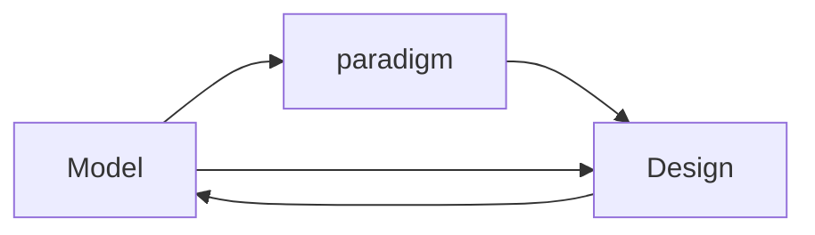

# O - Objective (觀察外在客觀、事實)

* 分析模型 (analysis model)
> 完全脫離於程式設計，分析與實作完全分離
* 分析與設計之間產生分歧，則兩者各自獲得的知識就無法彼此共享
* 模型驅動設計 (model-driven design)
> 不再將分析模型與程式設計分離，尋求足以滿足兩方面需求的單一模型，程式設計的每個物件皆反應模型中所描述的相應概念
* 從模型中取得用於程式設計和基本職責分配的術語
>   - 程式碼成為模型的表達 (expression)
>   - 程式碼的改變可能是模型的改變
* 建範模式 (modeling paradigm)

# R - Reflective (重視內在感受、反應)

* C 語言不適合 Model-Driven Design?
- 

# I - Interpretive (詮釋意義、價值、經驗)

* 
* 
 
# D - Decisional (找出決定、行動)

* 
* 