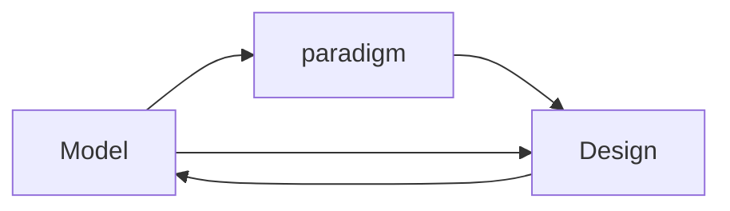

# O - Objective (觀察外在客觀、事實)

* 分析模型 (analysis model) - no good
> 完全脫離於程式設計，分析與實作完全分離
* 分析與設計之間產生分歧，則兩者各自獲得的知識就無法彼此共享

* 模型驅動設計 (model-driven design)
> - 不再將分析模型與程式設計分離，尋求足以滿足兩方面需求的單一模型，程式設計的每個物件皆反應模型中所描述的相應概念

> - 改變程式碼等於改變模型

> - 建模 和 實作 兩個過程分離則會產生問題

* 從模型中取得用於程式設計和基本職責分配的術語
>   - 程式碼成為模型的表達 (expression)
>   - 程式碼的改變可能是模型的改變
* 建範模式 (modeling paradigm)

### Hands-On Modelers
* 模型無法派上用場的原因
    * 模型的一些 intenet 在傳遞的過程中遺失，細節問題無法在 UML 圖呈現或討論
    * 模型與程式實作、技術的相互影響，無法針對實際遇到的問題做調整，則會使得<b>工作效率極低</b>，ex. work around solution
* 若程式設計師認為自己無須對模型負責，或不知道如何與程式相應，則兩者間就沒有任何關聯
* 程式設計師 = 建模人員
* 技術負責人協調『high-level 設計』與『建模』、並協助『最困難或最關鍵的決策』

> Ubiquitous Langugae 為開發人員、領域專家和軟體品質之間傳遞訊息的渠道

# R - Reflective (重視內在感受、反應)

* C 語言不適合 Model-Driven Design?
* 相關人員皆須了解或認識模型 

# I - Interpretive (詮釋意義、價值、經驗)

* 試作一個方法替代自動關閉瀏覽器的功能，但實際的需求面是可以保留畫面
* 
 
# D - Decisional (找出決定、行動)

* 大家須參與建模會議
* 修改程式碼前須先調整模型